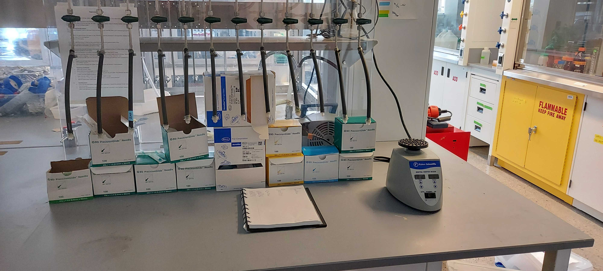

# labjournal
* Archiving of raw data is a key part of science quality control.
* Conventionally this is done in lab journals. Lab journals remain property of the lab. When you leave the lab, you need to photocopy or scan them to maintain access to the contents
* It is the expectation that the supervisor checks labjournals of students to make sure they are maintained in a way that is readable by others ensuring reproducibility of experiments. Unfortunately I have not met that expectation very well so far.
* My feeling is that currently better online platforms exist than paper. Advantages: 
1. Data is not lost in fires.
2. Data does not need to be photocopied or scanned when leaving your lab.
3. Better integration with photos taken with phones and other files.
4. Data is searchable.
5. Copy/paste operations can improve efficiency.
* Many platforms exist. After reading a few reviews, I have been exploring Github. Advantages:
1. Open source.
2. Excellent reputation: Having a github page improves your own reputation.
3. Very easy to create nicely formatted text with markup language (check out this file as example).
4. Easy to upload images from your phone and include them in your journal.
5. Easy to link or upload other files, such as spreadsheets. I would recommend to use a link to a google sheet though, instead of uplouding excel files - otherwise you're uploading and downloading a potentially large file all the time.
6. Easy to integrate with computer code, has versioning control if you're interested.

